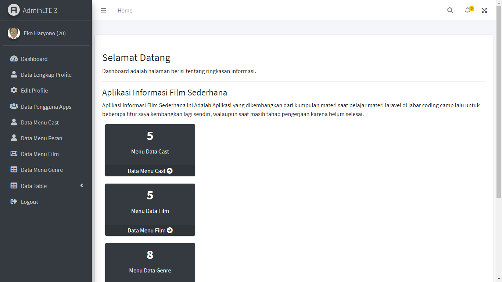
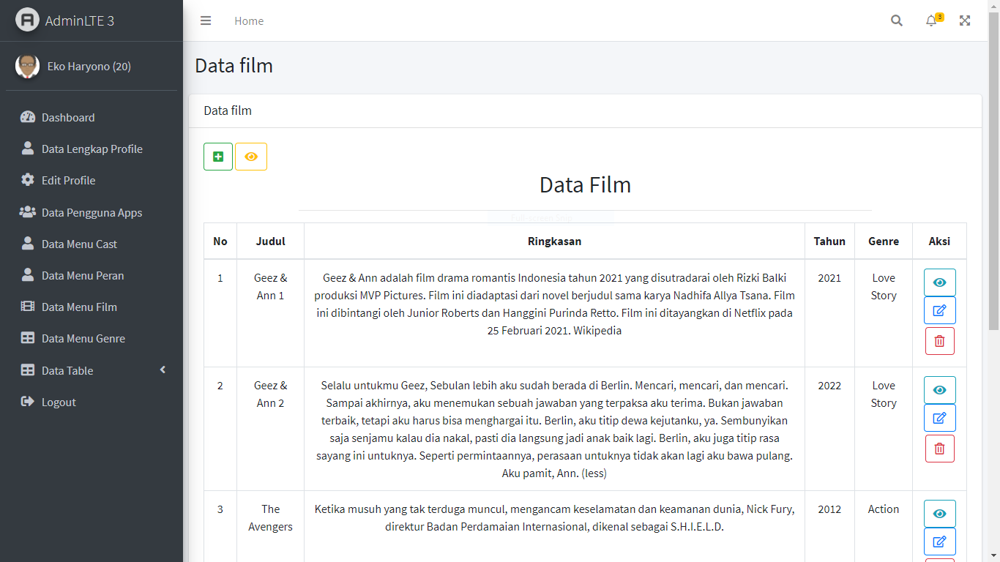
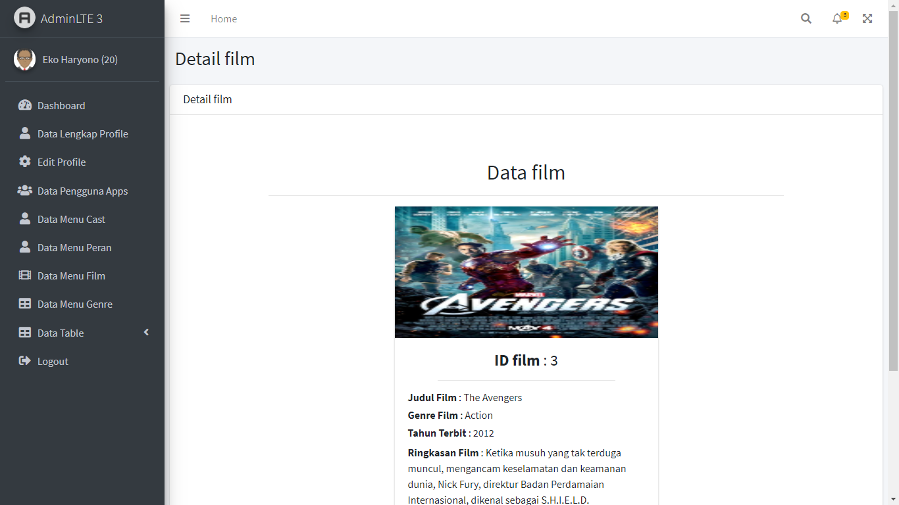

## Aplikasi Film Sederhana

Aplikasi Film Sederhana Ini Adalah Aplikasi yang dikembangkan dari kumpulan materi saat belajar materi laravel di jabar coding camp lalu untuk beberapa fitur saya kembangkan lagi sendiri, walaupun saat masih tahap pengerjaan karena belum selesai.

# Link Repo

<b>Notes : </b>Github Import Dari Gitlab Saya Pribadi 
<b>Gitlab : </b>https://gitlab.com/ekomh170/latihan-materi-18-laravel-eloquent-relationship.git 
<b>Github : </b>https://github.com/ekomh170/app-film-laravel-6-jcc.git 
<b>Notes : </b>Github Import Dari Gitlab Saya Pribadi

## Fitur Aplikasi

-   Login 
-   Register 
-   Logout 
-   Halaman Utama 
-   Data Lengkap Prorfile  
-   Edit Prorfile  

A.Data Pengguna Apps 

-   Tambah Data (Pengguna Apps) 
-   Ubah Data (Pengguna Apps) 
-   Hapus Data (Pengguna Apps) 
-   Detail Data (Pengguna Apps) 
-   Cari Data (Pengguna Apps)  

B. Data Menu Cast 

-   Tambah Data (Menu Cast) 
-   Ubah Data (Menu Cast) 
-   Hapus Data (Menu Cast) 
-   Detail Data (Menu Cast) 
-   Cari Data (Menu Cast)  

C. Data Menu Peran 

-   Tambah Data (Menu Peran) 
-   Ubah Data (Menu Peran) 
-   Hapus Data (Menu Peran) 
-   Detail Data (Menu Peran) 
-   Cari Data (Menu Peran)  

D. Data Menu Film 

-   Tambah Data (Menu Film) 
-   Ubah Data (Menu Film) 
-   Hapus Data (Menu Film) 
-   Detail Data (Menu Film) 
-   Cari Data (Menu Film)  

E. Data Menu Genre 

-   Tambah Data (Menu Genre) 
-   Ubah Data (Menu Genre) 
-   Hapus Data (Menu Genre) 
-   Detail Data (Menu Genre) 
-   Cari Data (Menu Genre)  

## Fitur Yang Akan Datang

-   Tampilan Menu Film Kedua  
-   Detail Tampilan Menu Film Kedua  
-   Menambahkan Fitur Notifikasi Film Terbaru  
-   Mengaktifkan Search All Data  

<b>Notes :</b> Untuk Penambahan Fitur Tidak Dapat di Tentukan Waktunya 

## Aplikasi Screenshot

## Alat Yang Digunakan Untuk Membuat Web :

A. Hardware :
Laptop Aspire E1-472G. Speaksifikasi :

-   Ram : 4GB DD3 L Memory
-   Prosesor : Intel Core i5-4200U 1.6 GHz with Turbo Boost up to 2.5 GHz
-   Tipe System : 64 bit
-   VGA : NVIDIA GEFORCE GT 720M with 2GB Dedicated VRAM
-   SSD : 128 GB

B. Software :

-   WAMP
-   Visual Studio Code
-   Sublime Merge
-   Git
-   PHP 7.4.9

C. Komponen

-   Laravel 6
-   Bootstrap 4
-   Template Tambahan :
    -   Adminlte 3 (Bootstrap 4) (Untuk Template Admin Full)
-   Library :
    -   Sweet Alert
    -   Datatables

